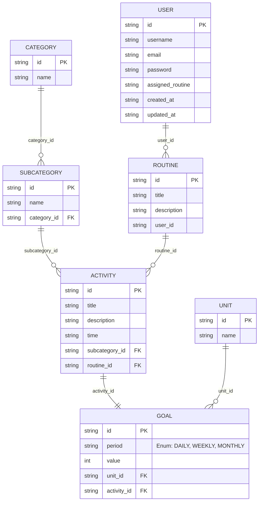

# **LifeSwap**

> Swap routines with strangers and experience new ways of living.

LifeSwap is a web app that allows users to upload their daily routine and randomly receive someone else's routine to follow for a day. The goal is to foster empathy, explore different habits, and step out of the comfort zone through unexpected experiences.

##  Equipo
### C24-24t-webapp
Integrantes: 
* Rosanne Celeste Lopez - Frontend y UX/UI
* Wilson Bernardo Bravo Ceballos - Backend
* Maria Angelica Castillo Sanchez - Qa tester

## 💻 Technologies
### FrontEnd

* [![Angular][Angular.io]][Angular-url]
* [![Tailwind][Tailwind]][Tailwind-Angular-url]
* [![Angular CDK][Angular-CDK]][Angular-CDK-url]

### BackEnd

* [![NestJS][nestjs.com]][NestJS-url]
* [![Prisma][prisma.io]][Prisma-url]
* [![PostgreSQL][postgresql.org]][PostgreSQL-url]

### Relational Database Diagram


## 🚀 Getting Started
### BackEnd
> Node version: ```>=20.x```

Create the ```.env``` file using the ```.env.example``` file as a reference

Install ```pnpm``` globally
```bash
npm install -g pnpm@9.14.2
```

Inside the ```backend``` directory, run the following command
```bash
pnpm install
```

Add the ```seeds``` to the database
```bash
pnpm prisma:seed
```
```bash
pnpm prisma:seed-routines
```

Run the application
```bash
pnpm run dev
```

### FrontEnd
### Prerequisites
* node.js: Version 20.x.x
* npm: Version 10.2.x 
#### You can verify your versions by running the following commands in your terminal:

```bash
node -v
npm -v
```
### Installation
### 1. Install dependencies.
```bash
npm install
```
### 2. Usage
```bash
ng serve
```

<!-- MARKDOWN LINKS & IMAGES -->
[Angular.io]: https://img.shields.io/badge/Angular-DD0031?style=for-the-badge&logo=angular&logoColor=white
[Angular-url]: https://angular.io/
[Tailwind]: https://img.shields.io/badge/-Tailwind%20CSS-%231a202c?style=for-the-badge&logo=tailwind-css
[Tailwind-Angular-url]:https://tailwindcss.com/docs/installation/framework-guides/angular

[Angular-CDK]: https://img.shields.io/badge/%20-Angular%20Material-blue?style=for-the-badge&logo=angular
[Angular-CDK-url]:https://material.angular.io/cdk/categories

[nestjs.com]: https://img.shields.io/badge/nestjs-E0234E?style=for-the-badge&logo=nestjs&logoColor=white
[NestJS-url]: https://nestjs.com/
[postgresql.org]: https://img.shields.io/badge/postgresql-4169e1?style=for-the-badge&logo=postgresql&logoColor=white
[PostgreSQL-url]: https://www.postgresql.org/
[prisma.io]: https://img.shields.io/badge/Prisma-3982CE?style=for-the-badge&logo=Prisma&logoColor=white
[Prisma-url]: https://www.prisma.io/
