# **LifeSwap**

> Intercambia rutinas con extraños y experimenta nuevas formas de vivir.

LifeSwap es una web app que permite a los usuarios subir su rutina diaria y recibir aleatoriamente la rutina de otra persona para intentar seguirla por un día. El objetivo es fomentar la empatía, la exploración de hábitos y salir de la zona de confort a través de experiencias inesperadas.

## 💻 Tecnologías Usadas
### FrontEnd

* [![Angular][Angular.io]][Angular-url]
* [![Tailwind][Tailwind]][Tailwind-Angular-url]
* [![Angular CDK][Angular-CDK]][Angular-CDK-url]

### BackEnd

* [![NestJS][nestjs.com]][NestJS-url]
* [![Prisma][prisma.io]][Prisma-url]
* [![PostgreSQL][postgresql.org]][PostgreSQL-url]

### Diagrama relacional de la Base de Datos

```mermaid
erDiagram
    CATEGORY {
        string id PK
        string name
    }

    SUBCATEGORY {
        string id PK
        string name
        string category_id FK
    }

    ACTIVITY {
        string id PK
        string title
        string description
        string time_range "Enum: mañana, tarde, noche"
        string time
        string subcategory_id FK
        string routine_id FK
    }

    GOAL {
        string id PK
        string period "Enum: diario, semanal, mensual"
        int value
        string unit_id FK
        string activity_id FK
    }

    UNIT {
        string id PK
        string name
    }

    ROUTINE {
        string id PK
        string title
        string description
    }

    CATEGORY ||--o{ SUBCATEGORY : "category_id"
    SUBCATEGORY ||--o{ ACTIVITY : "subcategory_id"
    ACTIVITY ||--|| GOAL : "activity_id"
    UNIT ||--o{ GOAL : "unit_id"
    ROUTINE ||--o{ ACTIVITY : "routine_id"
```


## 🚀 Primeros pasos
### BackEnd
> Node version: ```>=22.x```

Crear el archivo ```.env``` usando como ejemplo el archivo ```.env.example```

instalar pnpm globalmente usando el siguiente comando
```bash
npm install -g pnpm@9.14.2
```

Dentro del directorio ```backend``` ejecutar el siguiente comando
```bash
pnpm install
```

### FrontEnd
### Prerequisites
* node.js: Version 20.x.x
* npm: Version 10.2.x 
#### You can verify your versions by running the following commands in your terminal:

```bash
node -v
npm -v
```
### Installation
### 1. Install dependencies.
```bash
npm install
```
### 2. Usage
```bash
ng serve
```

<!-- MARKDOWN LINKS & IMAGES -->
[Angular.io]: https://img.shields.io/badge/Angular-DD0031?style=for-the-badge&logo=angular&logoColor=white
[Angular-url]: https://angular.io/
[Tailwind]: https://img.shields.io/badge/-Tailwind%20CSS-%231a202c?style=for-the-badge&logo=tailwind-css
[Tailwind-Angular-url]:https://tailwindcss.com/docs/installation/framework-guides/angular

[Angular-CDK]: https://img.shields.io/badge/%20-Angular%20Material-blue?style=for-the-badge&logo=angular
[Angular-CDK-url]:https://material.angular.io/cdk/categories

[nestjs.com]: https://img.shields.io/badge/nestjs-E0234E?style=for-the-badge&logo=nestjs&logoColor=white
[NestJS-url]: https://nestjs.com/
[postgresql.org]: https://img.shields.io/badge/postgresql-4169e1?style=for-the-badge&logo=postgresql&logoColor=white
[PostgreSQL-url]: https://www.postgresql.org/
[prisma.io]: https://img.shields.io/badge/Prisma-3982CE?style=for-the-badge&logo=Prisma&logoColor=white
[Prisma-url]: https://www.prisma.io/